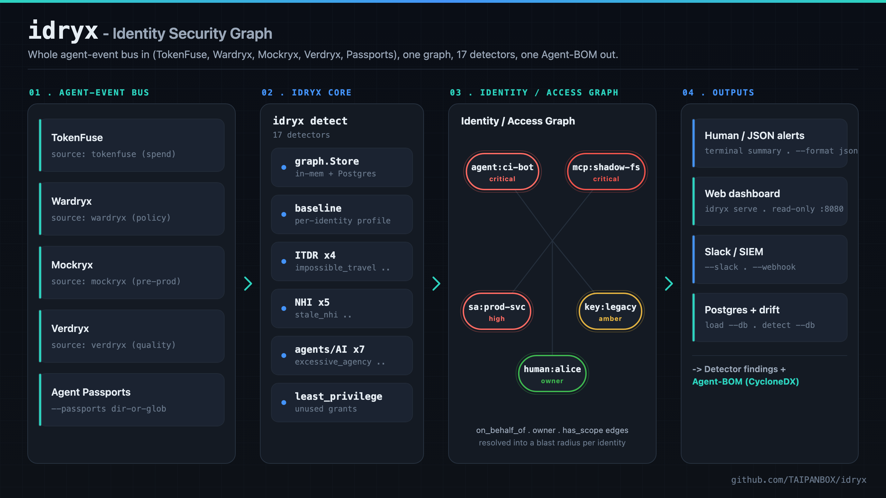
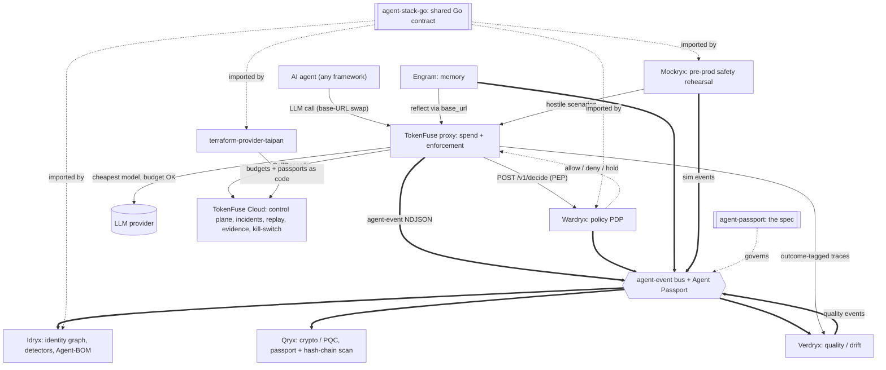
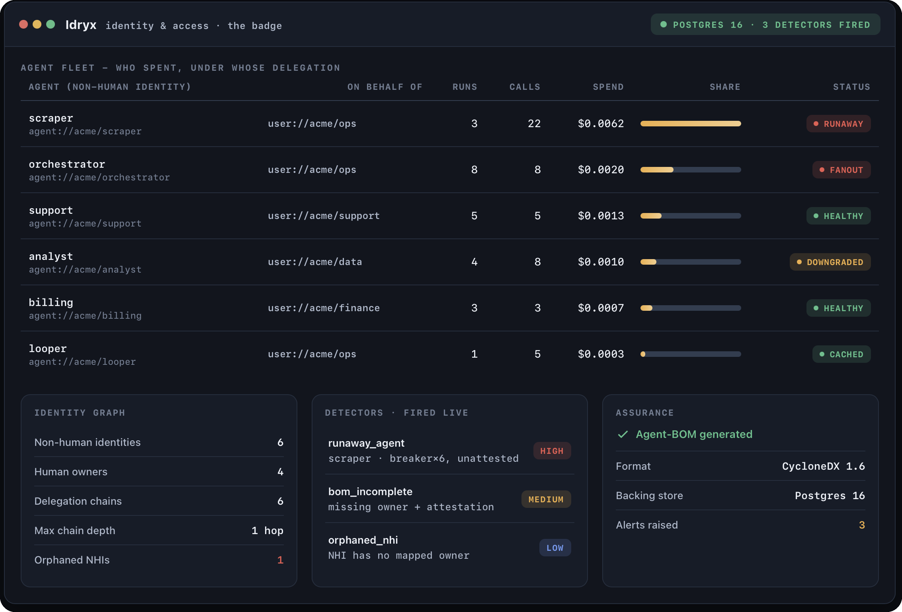
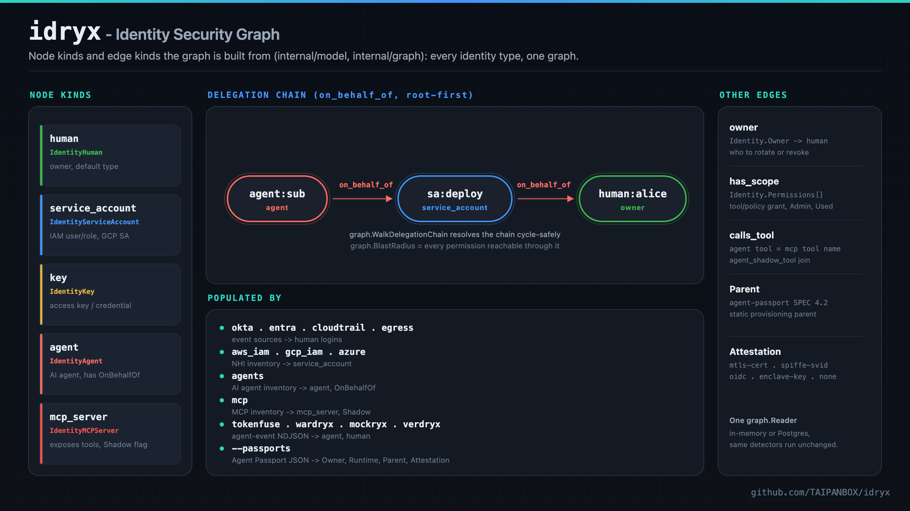
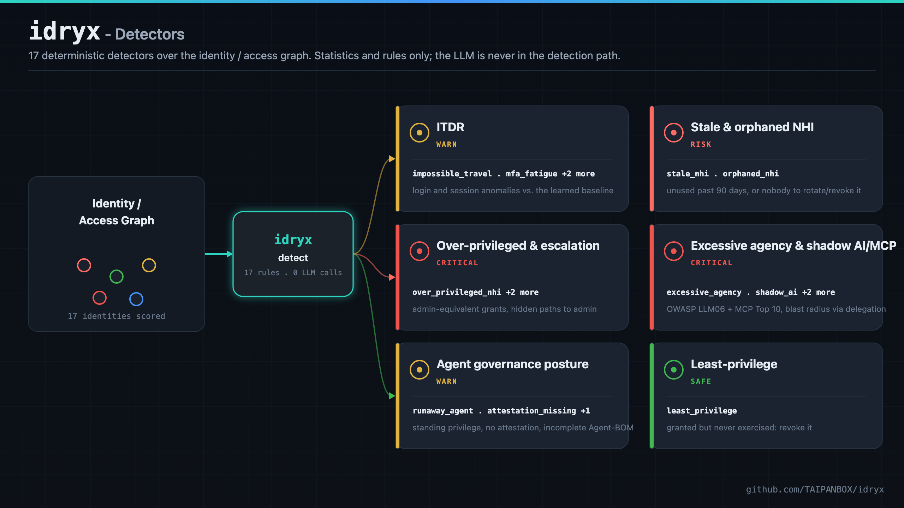

<div align="center">

# idryx - Identity Security Graph

**Read-only connectors stitch humans, service accounts, keys, and AI agents into one identity / access graph, then flag excessive privilege and anomalous behavior.**

[](https://github.com/TAIPANBOX/idryx/actions/workflows/ci.yml)




</div>

idryx is a security layer on top of an organization's existing IdPs, clouds, and
gateways: it reads the data Okta, Entra, AWS, GCP, and Azure already generate,
plus the whole TAIPANBOX agent-event bus, and stitches every identity type,
humans, service accounts, keys, MCP servers, and AI agents, into a single
identity / access graph. Twenty-one deterministic detectors then surface excessive
privilege and anomalous behavior across that graph. Open-core, dev-first, built
for mid-market. See [`idryx-plan.md`](idryx-plan.md) for the full design and
roadmap.

---

## Where this fits in the stack

Idryx is the access/identity plane of the TAIPANBOX agent-governance stack: it builds the identity graph and runs detectors (runaway agents, missing attestation, incomplete BOM) from TokenFuse's event stream and Agent Passports.



- **Consumes**: agent-event NDJSON from every bus producer (**TokenFuse**, **Wardryx**,
  **Mockryx**, **Verdryx**) and Agent Passports, both via **agent-stack-go**.
- **Produces**: the identity graph, detector findings (`runaway_agent`, `attestation_missing`, `bom_incomplete`), and an Agent-BOM (CycloneDX).
- **Talks to**: **TokenFuse**, **Wardryx**, **Mockryx**, **Verdryx** (event sources), **agent-passport** (identity schema it validates against); imports **agent-stack-go**.

The full stack is TokenFuse (spend), Wardryx (policy), Engram (memory), Idryx (access), Qryx (crypto), Verdryx (quality), Mockryx (pre-prod), on the shared Agent Passport + agent-event contract (agent-stack-go / agent-passport), configured via terraform-provider-taipan.

## Live infrastructure validation

Before any public launch, Idryx was run against a real Postgres 16 backend and real agent-fleet event
data: 16/16 integration tests pass, the delegation-chain backfill migration is correct and idempotent,
and the full detector suite fires correctly off Postgres-backed state.



Full write-up and all numbers: [`VALIDATION.md`](VALIDATION.md).

---

## What it does

1. **Ingest** - read-only connectors to IdPs, clouds, secrets stores, GitHub,
   Kubernetes, and agent runtimes, normalized into one model.
2. **Graph** - every identity type and its permissions, events, owners, and
   delegation chains in a single identity / access graph.
3. **Baseline + detection** - per-identity normal behavior; deterministic
   detection of anomalies and excessive privilege (ITDR, NHI, least-privilege).
4. **Remediation** - least-privilege recommendations and credential rotation
   (cloud secrets and agent tokens), delivered as PRs and alerts (SIEM / Slack / OTLP).

idryx is a complete MVP for detection and remediation and has passed a security
self-review (see [`SECURITY.md`](SECURITY.md)). Still ahead, per
[`idryx-plan.md`](idryx-plan.md): the eBPF network-behavior layer. Blocking,
`apply`-style enforcement is intentionally out of scope: idryx proposes, it
never mutates.

---

## One graph, every identity

<div align="center">

</div>

Every identity in the graph is one of five node kinds, defined in
[`internal/model/identity.go`](internal/model/identity.go):

| Node kind | Go type | What it is |
|---|---|---|
| `human` | `IdentityHuman` (the zero value) | a person, the default identity type |
| `service_account` | `IdentityServiceAccount` | an IAM user/role, GCP service account, or Azure service principal |
| `key` | `IdentityKey` | an access key or credential |
| `agent` | `IdentityAgent` | an AI agent, carries `OnBehalfOf` and `Runtime` |
| `mcp_server` | `IdentityMCPServer` | an MCP server exposing tools, carries the `Shadow` flag |

Identities are connected by a small set of real edges, resolved by
[`internal/graph`](internal/graph):

| Edge kind | Source field | What it means |
|---|---|---|
| `on_behalf_of` | `Identity.OnBehalfOf` (ordered, root-first) | the dynamic delegation chain: who this identity is acting for right now |
| `owner` | `Identity.Owner` | the human or team accountable for rotating/revoking this identity |
| `has_scope` | `Identity.Permissions[]` | a tool/policy grant, each carrying `Admin` and `Used` flags |
| `calls_tool` | agent `Permissions[].Name` matched against an `mcp_server`'s `Permissions[].Name` | the join `agent_shadow_tool` uses to trace a poisoned tool to the agent that can call it |
| `Parent` | `Identity.Parent` | the agent's *static* provisioning parent (agent-passport SPEC §4.2, an org-chart relationship), distinct from the dynamic `on_behalf_of` chain |

idryx stitches humans, service accounts, keys, and AI agents into a single graph
linked by **ownership** and **`on_behalf_of`** delegation. Resolving those edges
is what lets idryx compute an identity's true blast radius:
`excessive_agency` (OWASP **LLM06**) fires when an AI agent reaches
admin-equivalent permissions **through its delegation chain**, agent -> sub-agent
-> service account -> human. An agent's blast radius is the **union** of what
every identity it can act as may do, and severity rises with delegation depth.

Both `graph.WalkDelegationChain` (cycle-safe) and `graph.BlastRadius` (the
de-duplicated union of every permission reachable through the chain) are shared
by `excessive_agency`, `runaway_agent`, and the dashboard's delegation view: one
core, reused everywhere agent reach matters.

### Agent identities and the Agent Passport

Agents and the humans in their delegation chain share one identifier scheme,
`agent://` and `user://` URIs, across two complementary connectors that both
speak the [agent-passport](https://github.com/TAIPANBOX/agent-passport) spec:

- **Agent Passport documents** (`--passports <dir-or-glob>`) - one small, static
  JSON file per agent: `owner`, `runtime`, `parent`, and `attestation.method`
  (`none` / `oidc` / `spiffe-svid` / `enclave-key` / `mtls-cert`). Capture-only
  metadata, layered onto whichever graph a `--source`, `--load`, or `--db`
  already built.
- **Agent-event bus behavioral events** (`--source tokenfuse|wardryx|mockryx|verdryx`
  / `--load tokenfuse:` / `wardryx:` / `mockryx:` / `verdryx:<path|glob>`): NDJSON
  `taipanbox.dev/agent-event` envelopes (schema v0.1 or v0.2), the shared wire
  format every producer on the bus writes: **TokenFuse** (spend), **Wardryx**
  (policy), **Mockryx** (pre-prod rehearsal), **Verdryx** (quality/drift), and
  any future emitter. Agent/human identities come from `agent_id`/`on_behalf_of`;
  each event carries its producer's own `source` field verbatim, so a Wardryx
  policy event and a TokenFuse spend event on the same agent are never confused
  with one another. Known TokenFuse event types (`budget_exhausted`,
  `sustained_loop`, `spend_spike`, `fanout_explosion`, `breaker_tripped`,
  `dlp_block`, `taint_block`, `mcp_drift`) map to named constants; any other
  type, from TokenFuse or another producer, is tolerated generically.

Two detectors read this agent-governance state directly: `attestation_missing`
(fires on standing privilege alone, a privileged/admin agent with no
attestation on record) and `runaway_agent` (correlates a TokenFuse
spend/runaway incident with everything else idryx knows about that agent:
privilege, delegation depth, attestation, and blast radius).

---

## Detectors

<div align="center">

</div>

Detection is **deterministic** (statistics + rules over the graph); the LLM is
used only as an interface (natural-language queries, explanations) and is
**never in the detection path**. `--privileged` raises severity for sensitive
accounts. The **baseline engine** learns what is normal per identity and
suppresses scoring during a learning period to avoid false positives.

| Detector | Family | Severity | What it flags |
|---|---|---|---|
| `impossible_travel` | ITDR | high, critical if privileged | two successful logins too far apart to be feasible |
| `mfa_fatigue` | ITDR | high, critical if privileged | a burst of MFA challenges in a short window (push-bombing) |
| `new_device` | ITDR | high | a privileged identity logging in from an unseen device |
| `behavior_anomaly` | ITDR | medium, high if privileged | login deviating from the identity's learned baseline (new country / device / active-hour) |
| `stale_nhi` | NHI | medium, high if admin | a service account unused past a 90-day window (or never used) |
| `over_privileged_nhi` | NHI | high | an NHI holding admin-equivalent permissions |
| `orphaned_nhi` | NHI | low | an NHI with no mapped owner (nobody to rotate or revoke it) |
| `privilege_escalation` | NHI | high | an NHI holding a stealthy escalation permission (AWS `iam:PassRole`/`PutRolePolicy`, GCP `actAs`/`getAccessToken`, Azure `roleAssignments/write`) that grants a path to admin without holding admin |
| `shared_credential` | NHI | high | an NHI whose credential is used across many distinct IPs, countries, or devices, the signature of a leaked or shared key |
| `excessive_agency` | Agents / AI | high, critical at deeper delegation | an AI agent that reaches admin-equivalent permissions through its delegation chain (OWASP LLM06) |
| `shadow_ai` | Agents / AI | medium, high for NHIs/agents | an identity whose egress reaches a known external LLM API (OpenAI, Anthropic, Gemini) |
| `unmanaged_egress` | Agents / AI | medium, high if the destination is a known LLM API | a real outbound connection observed only via the eBPF sensor (`idryx ebpf-capture`), attributable to a process name and nothing else: no IAM, agent-event, or Passport record for it |
| `shadow_mcp` | Agents / AI | high, critical if high-risk tools exposed | an MCP server in use but absent from the sanctioned registry (OWASP MCP Top 10: Shadow MCP Servers) |
| `agent_shadow_tool` | Agents / AI | high, critical if the shared tool is high-risk | an AI agent whose declared tools are exposed by a shadow MCP server, the path a poisoned tool takes to reach a model |
| `runaway_agent` | Agents / AI | medium base, high at 2 corroborating facts, critical at 3+ | a TokenFuse spend/runaway incident correlated with the agent's privilege, delegation depth, attestation, and blast radius |
| `attestation_missing` | Agents / AI | high | a privileged AI agent whose identity has no attestation on record (agent-passport SPEC §4.3) |
| `bom_incomplete` | Agents / AI | medium | an agent missing the governance-critical fields an Agent-BOM needs: owner, runtime, or attestation |
| `data_exfiltration` | Agents / AI | high, critical at 2x threshold or if privileged/admin | an AI agent accumulating DLP-blocked actions within a 24h window, a repeated attempt to move sensitive data out |
| `tainted_agent` | Agents / AI | high, critical on repeat or if privileged/admin | an AI agent with a taint-tracked action blocked, a traced injection/exfiltration attempt stopped before it landed |
| `mcp_drift` | Agents / AI | high, critical on repeat or if privileged/admin | an MCP server's config or exposed tooling changing under an agent, a supply-chain/config-integrity signal |
| `least_privilege` | Least-privilege | medium, high for an unused admin grant | granted permissions never exercised, with a revocation recommendation |

`agent_shadow_tool` needs the `agents` and `mcp` sources stitched into one
graph: `idryx detect --load agents:agents.json --load mcp:mcp.json`.
`least_privilege` fires only for identities that have usage data, so sources
without an observed-usage signal produce no false recommendations.

---

## Architecture

One core (graph + baseline + detection), many connectors on the input. Each
direction, ITDR, NHI, least-privilege, eBPF, agents, is a new connector of the
same core, not a separate product. Data flows **source -> graph -> detectors ->
output**:

```
cmd/idryx/main.go          CLI: detect | serve | load | bom | remediate | version
internal/model               Identity, Event, Permission, Alert, Severity (shared types)
internal/ingest               source connectors -> []model.Event or []model.Identity
internal/ingest/tokenfuse       TokenFuse agent-event NDJSON (identities + events)
internal/ingest/passport        Agent Passport JSON documents (identity enrichment)
internal/ebpfcapture         Linux-only eBPF sensor: sys_enter_connect -> egress-shaped
                              flows (root/CAP_BPF, see SECURITY.md); feeds internal/ingest's
                              egress connector via idryx ebpf-capture -out + --load egress:
internal/graph                Store (in-memory) + PgStore (Postgres); both satisfy graph.Reader
internal/baseline            per-identity behavioral baseline (Build / NewProfile+Observe / Score)
internal/detect               Detector interface
internal/detect/detectors      the concrete detectors
internal/bom                  Agent-BOM builder + CycloneDX-shaped rendering
internal/remediation          right-sizing + credential-rotation Terraform generation
internal/enforce              opens a GitHub PR from remediation output (git+gh; never applies)
internal/report               human + JSON alert rendering
internal/sink                 Slack + generic webhook delivery
internal/server               read-only HTTP dashboard + JSON API
```

Design principles, held as hard rules:
- **Deterministic detection.** Detectors are statistics + rules over the graph.
  The LLM is used only as an interface (natural-language queries,
  explanations); it is never in the detection path, which stays deterministic
  and auditable.
- **Read-only.** idryx observes; it never mutates the IdP or cloud. `remediate`
  proposes Terraform and can open a PR; it never applies.
- **One `graph.Reader`.** Detectors depend on the interface, never the concrete
  `*graph.Store`, so the same detectors run unchanged against the Postgres
  backend.

---

## Stack

- **Core / ingest:** Go (Rust for hot paths)
- **Graph:** Postgres (with recursive CTEs) -> graph DB if needed
- **Analytics / baseline / detection:** Python
- **API:** Go (gRPC / REST)
- **UI:** TypeScript (React)
- **License:** open-core (Apache-2.0 core + paid connectors / enforcement / SaaS)

---

## Install

Prebuilt binaries (Linux, macOS, Windows) are published on the
[Releases page](https://github.com/TAIPANBOX/idryx/releases) for every `v*` tag,
with a `SHA256SUMS` file for verification:

```sh
tar -xzf idryx_v*_$(uname -s | tr A-Z a-z)_$(uname -m | sed 's/x86_64/amd64/;s/aarch64/arm64/').tar.gz
sha256sum -c SHA256SUMS --ignore-missing
./idryx version
```

Or build from source (Go 1.26+):

```sh
make build   # -> ./bin/idryx
```

> Maintainers: a release is cut automatically by CI on `git tag vX.Y.Z && git push --tags`.

## Quick start

```sh
make build

# detect: run detectors, print or deliver alerts
./bin/idryx detect <log.json>                       # human-readable report
./bin/idryx detect --format json <log.json>         # JSON alerts
./bin/idryx detect --source aws_iam <log.json>      # okta|entra|cloudtrail|egress|aws_iam|gcp_iam|azure|agents|mcp|tokenfuse|wardryx|mockryx|verdryx
./bin/idryx detect --privileged alice@x.com ...     # mark privileged accounts
./bin/idryx detect --slack <url> <log.json>         # deliver alerts to Slack
./bin/idryx detect --webhook <url> <log.json>       # deliver alerts to a SIEM/SOAR
./bin/idryx detect --min-severity critical ...      # delivery threshold (default high)

# least-privilege: enrich inventory with observed usage to flag unused grants
./bin/idryx detect --source aws_iam --cloudtrail ct.json iam.json    # mark used AWS permissions
./bin/idryx detect --source gcp_iam --gcp-audit  audit.json iam.json # mark used GCP roles

# agent identities: TokenFuse events + Passport enrichment (owner/runtime/parent/attestation)
./bin/idryx detect --source tokenfuse --passports ./passports events.ndjson
./bin/idryx detect --load tokenfuse:events.ndjson --passports "passports/*.json"

# whole agent-event bus: stitch TokenFuse + Wardryx + Mockryx + Verdryx into one graph
./bin/idryx detect --load tokenfuse:tf.ndjson --load wardryx:wx.ndjson \
  --load mockryx:mx.ndjson --load verdryx:vx.ndjson

# bom: Agent-BOM, a CycloneDX-shaped inventory of every agent identity
./bin/idryx bom <log.json>                          # JSON (CycloneDX-shaped), the default
./bin/idryx bom --format human <log.json>           # human-readable

./bin/idryx remediate --source aws_iam iam.json     # right-size + rotate stale credentials
./bin/idryx remediate --source agents agents.json   # right-size tools + rotate agent tokens
./bin/idryx remediate --source aws_iam --out ./tf iam.json  # write .tf artifacts + manifest.json (read-only)
./bin/idryx remediate --save-db "$DSN" iam.json     # persist recommendations into Postgres
./bin/idryx remediate --open-pr --repo ../iac iam.json  # open a GitHub PR with the .tf (git+gh; never applies)

# serve: read-only web dashboard + JSON API
./bin/idryx serve <log.json>                        # dashboard on :8080
./bin/idryx serve --addr :9000 <log.json>           # custom address

# load: persist a log into a Postgres graph, then read from it
./bin/idryx load --db "$DSN" <log.json>             # ingest into Postgres
./bin/idryx detect --db "$DSN"                      # detect from the DB
./bin/idryx serve  --db "$DSN"                      # dashboard from the DB

# ebpf-capture: Linux, root (or CAP_BPF+CAP_PERFMON), see SECURITY.md
sudo ./bin/idryx ebpf-capture -duration 30s -out captured.json  # live-capture outbound connections
./bin/idryx detect --load egress:captured.json                  # same pipeline every other source uses
```

Run against the bundled fixtures:

```sh
make detect    # ITDR detectors over the event fixtures
make nhi       # NHI + agent + shadow-ai detectors over the inventory fixtures
make remediate # least-privilege + credential-rotation snippets over the inventory fixtures
make serve     # then open http://localhost:8080
```

---

## What works today

A CLI that ingests an identity log or inventory, normalizes it into an identity
graph, builds per-identity behavioral baselines, resolves delegation chains, and
runs deterministic detectors.

**Source connectors**

| Connector | Kind | What it reads |
| --- | --- | --- |
| `okta` | events | Okta System Log |
| `entra` | events | Microsoft Entra ID sign-in log |
| `cloudtrail` | events | AWS CloudTrail (ConsoleLogin + API activity) |
| `egress` | events | generic network-egress (identity -> destination host; VPC flow / proxy / CASB, or idryx's own `ebpf-capture` sensor, see below) |
| `aws_iam` | NHI inventory | IAM users/roles as service accounts, with permissions, owner tags, last-used |
| `gcp_iam` | NHI inventory | GCP service accounts + project IAM policy, with roles and owner hints (optional Cloud Audit Log usage enrichment via `--gcp-audit`) |
| `azure` | NHI inventory | Azure AD service principals + role assignments, with owners and credential expiry |
| `agents` | agent inventory | AI agents with runtime, tools/scopes, used tools, and the identity each acts `on_behalf_of` |
| `mcp` | MCP inventory | MCP servers and their exposed tools, checked against the sanctioned registry to surface shadow servers |
| `tokenfuse` / `wardryx` / `mockryx` / `verdryx` | agent identities + behavioral events | NDJSON [agent-passport](https://github.com/TAIPANBOX/agent-passport) `taipanbox.dev/agent-event` envelopes (schema v0.1 or v0.2; one file or a glob via `--load tokenfuse:`/`wardryx:`/`mockryx:`/`verdryx:path/*.ndjson`), one connector shared by every bus producer |
| `--passports <dir-or-glob>` | agent identity enrichment | static [agent-passport](https://github.com/TAIPANBOX/agent-passport) `taipanbox.dev/agent-passport/v0.1` JSON documents, one per agent, layered onto whichever source/`--load`/`--db` built the graph |

**Detectors** - see the [Detectors](#detectors) table above: 21 detectors across
ITDR, NHI, agents/AI, and least-privilege.

**Baseline engine** (`internal/baseline`) - learns what is normal per identity
and suppresses scoring during a learning period; the same engine extends to
service accounts and AI agents. Detection is deterministic; LLMs are never in
the path.

**Delegation graph** (`internal/graph`) - resolves `on_behalf_of` edges (agent
-> sub-agent -> service account -> human) with cycle protection, computing each
identity's effective permissions and blast radius.

**Agent-BOM** (`internal/bom`, `idryx bom`) - a defensive governance inventory
of an operator's own AI agent identities: owner, runtime, attestation,
tools/permissions, delegation chain, and blast radius, rendered as a
CycloneDX-shaped document (`internal/bom/cyclonedx.go`). `bom_incomplete` is
its companion detector, flagging agents the BOM cannot yet fully prove.

**Alert delivery** (`internal/sink`) - alerts at or above `--min-severity` are
pushed to a Slack incoming webhook (`--slack`) and/or a generic JSON webhook
for SIEM/SOAR (`--webhook`). Fully-filtered batches make no network call.
`--webhook-header "Name: Value"` (repeatable) sets outbound headers, which is
how the destination authenticates the sender:

```sh
idryx detect --load tokenfuse:events.ndjson \
  --webhook 'https://cloud.example/v1/findings?source=idryx' \
  --webhook-header "Authorization: Bearer $OPS_KEY"
```

TokenFuse Cloud's `/v1/findings` accepts this payload as-is, which puts an
idryx finding in front of the operator holding the phone, labelled with the
service that made it. Headers are outbound only: nothing about what idryx
reads, or how it detects, changes.

**Web dashboard** (`internal/server`, `idryx serve`) - a read-only HTTP server
with a self-contained HTML dashboard and a JSON API (`/api/alerts`,
`/api/identities`, `/api/remediations`, `/healthz`). Read-only by design: idryx
observes, it never mutates the IdP.

**Postgres graph** (`internal/graph`, pgx) - `idryx load --db <dsn>` persists
events into Postgres; `detect` / `serve --db` read a snapshot back. The
snapshot implements the same `graph.Reader` the in-memory store does, so
detectors run unchanged. The schema (`internal/graph/schema.sql`)
additionally carries a producer-assigned `events.severity` column
(`model.Event.Severity`, used by `tokenfuse`), the Passport-derived
`identities.parent`/`identities.attestation` columns, and an ordered
`on_behalf_of` join table for full delegation chains (agent-passport SPEC §5),
all applied as additive `IF NOT EXISTS` migrations, so an existing database
upgrades in place. Integration tests live behind the `integration` build tag
and run in CI against a Postgres service (`make test-integration` with
`DATABASE_URL`).

**eBPF network sensor** (`internal/ebpfcapture`, `idryx ebpf-capture`) -
Linux-only, root (or `CAP_BPF`+`CAP_PERFMON`) sensor attached to the
`sys_enter_connect` tracepoint via `cilium/ebpf`, capturing real outbound
connections (pid, process name, destination) with no dependency on IAM,
agent-event, or Passport data. Writes an egress-shaped log consumed by the
same `--load egress:` pipeline every other source uses. Known LLM API
destinations are resolved to their hostname so the existing `shadow_ai`
detector reasons over eBPF-captured traffic for free; its own
`unmanaged_egress` detector flags any identity this sensor is the *only*
evidence for. See
[`SECURITY.md`](SECURITY.md#ebpf-network-sensor-ebpf-capture) for what it
does and deliberately does not do.

---

## Status

**Phases 0-3 plus a first eBPF network-behavior layer shipped** (beaconing,
JA3/JA4, DNS-tunnel detection, and full identity correlation remain, see
[`idryx-plan.md`](idryx-plan.md)'s Phase 4):

- [x] Phase 0 - ITDR core, in-memory graph, CLI, CI
- [x] Phase 1 - baseline engine, Entra/CloudTrail connectors, Slack/SIEM delivery, web dashboard, Postgres graph
- [x] Phase 2 - NHI (AWS/GCP/Azure), agents + delegation graph, shadow AI/MCP, least-privilege
- [x] Phase 3 - remediation: right-sizing + rotation Terraform, PR enforcement (read-only)
- [x] 21 deterministic detectors across ITDR, NHI, agents/AI, and least-privilege
- [x] Agent-BOM (CycloneDX-shaped) via `idryx bom`, with its `bom_incomplete` companion detector
- [x] Security self-review passed (see [`SECURITY.md`](SECURITY.md))
- [x] eBPF network-behavior layer (descoped first version): Linux sensor on
      `sys_enter_connect` (`idryx ebpf-capture`), its `unmanaged_egress`
      detector, live-validated against real traffic on a disposable VM (see
      [`SECURITY.md`](SECURITY.md#ebpf-network-sensor-ebpf-capture)); the
      original larger spec's beaconing/JA3-JA4/DNS-tunneling/identity
      correlation stays Phase 4

See [`idryx-plan.md`](idryx-plan.md) for the full design and roadmap.

## Security

idryx is a security product, so its own trust boundaries are documented. See
[`SECURITY.md`](SECURITY.md) for the threat model, the read-only / deterministic
design invariants, and how to report a vulnerability privately.

## License

[Apache-2.0](LICENSE).
