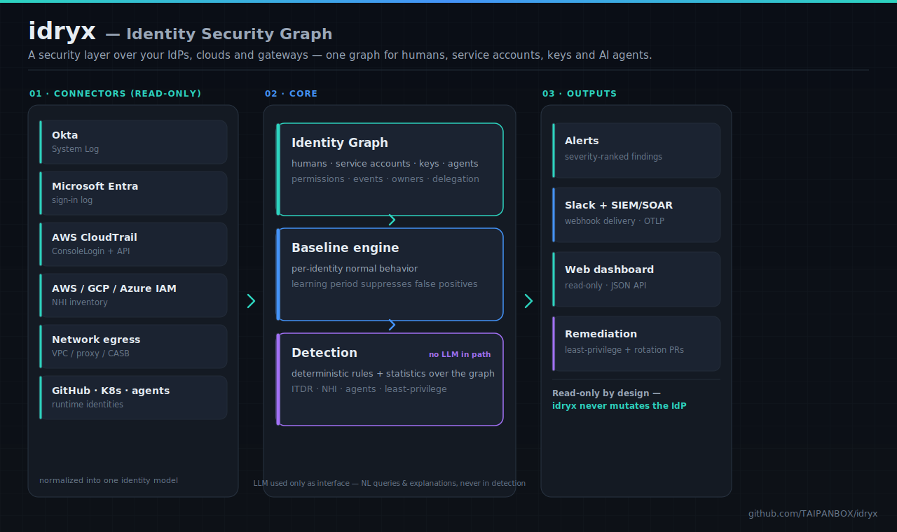
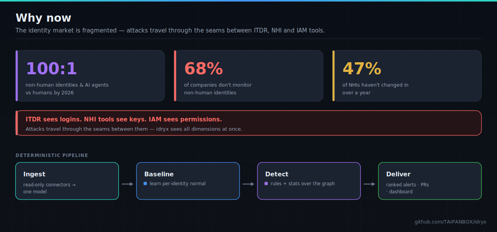
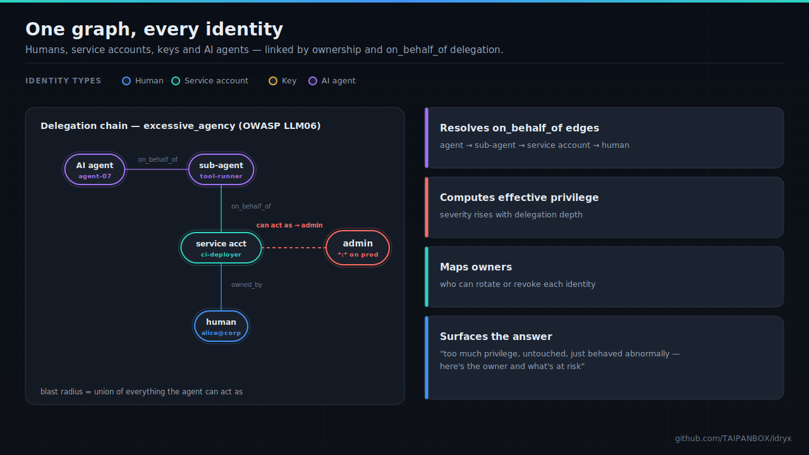
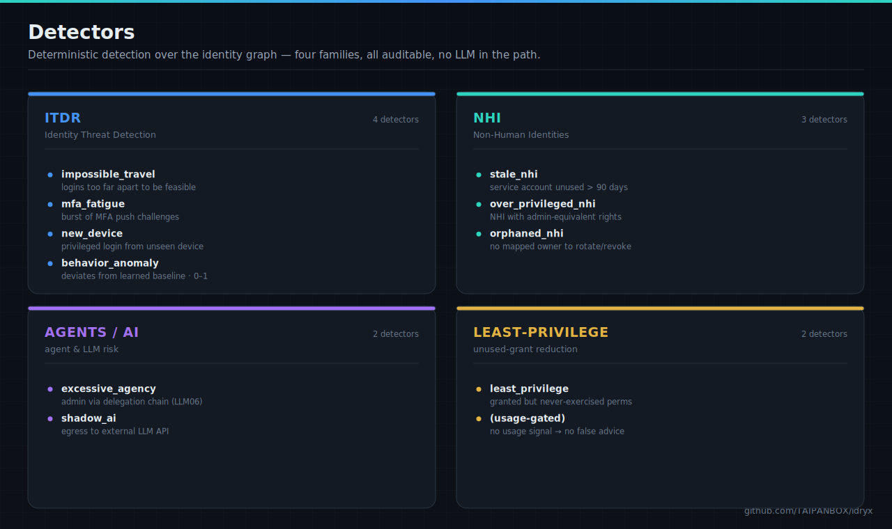

<div align="center">

# idryx — Identity Security Graph

**A security layer on top of your existing IdPs, clouds, and gateways.** idryx reads
the data Okta / Entra / AWS / GCP / Azure / Keycloak already generate, stitches every
identity type — humans, service accounts, keys, and AI agents — into a single graph,
and surfaces excessive privilege and anomalous behavior. Open-core, dev-first, built
for mid-market.

[](LICENSE)
[](go.mod)
[](#detectors)
[](#one-graph-every-identity)
[](#status--roadmap)
[](https://github.com/TAIPANBOX/idryx/commits/main/)

<br/>



</div>

> **One core, many connectors.** Each direction — ITDR, NHI, least-privilege, eBPF,
> agents — is a new connector of the same core, not a separate product. The LLM is
> used only as an interface (NL queries, explanations), **never in the detection
> path**, which stays deterministic and auditable.

---

## Table of contents

- [Why](#why)
- [What it does](#what-it-does)
- [One graph, every identity](#one-graph-every-identity)
- [Agent identities and the Agent Passport](#agent-identities-and-the-agent-passport)
- [Detectors](#detectors)
- [Architecture](#architecture)
- [Stack](#stack)
- [Install](#install)
- [Quick start](#quick-start)
- [What works today](#what-works-today)
- [Status & roadmap](#status--roadmap)
- [Security](#security)
- [License](#license)

---

## Why

The identity market is fragmented: **ITDR** sees logins, **NHI** tools see keys,
**IAM** tools see permissions. Attacks travel through the seams between them. idryx
sees all dimensions at once and answers the question nobody answers today:

> *"This identity (human / service / agent) has too much privilege, hasn't been
> touched in a long time, and just behaved abnormally — here is the owner and what is
> at risk."*

<div align="center">

</div>

By 2026, non-human identities and AI agents outnumber humans roughly **100:1**, yet
**68%** of companies don't monitor them; **47%** of NHIs haven't changed in over a
year.

---

## What it does

1. **Ingest** — read-only connectors to IdPs, clouds, secrets stores, GitHub,
   Kubernetes, and agent runtimes, normalized into one model.
2. **Graph** — every identity type and its permissions, events, owners, and
   delegation chains in a single Identity Graph.
3. **Baseline + detection** — per-identity normal behavior; deterministic detection
   of anomalies and excessive privilege (ITDR, NHI, least-privilege).
4. **Remediation** — least-privilege recommendations and credential rotation
   (cloud secrets and agent tokens), delivered as PRs
   and alerts (SIEM / Slack / OTLP).

See [`idryx-plan.md`](idryx-plan.md) for the full design and roadmap.

idryx is a complete MVP for detection and remediation and has passed a security
self-review (see [`SECURITY.md`](SECURITY.md)). Still ahead, per
[`idryx-plan.md`](idryx-plan.md): the eBPF network-behavior layer. Blocking,
`apply`-style enforcement is intentionally out of scope — idryx proposes, it
never mutates.

---

## One graph, every identity

idryx stitches humans, service accounts, keys, and AI agents into a single graph
linked by **ownership** and **`on_behalf_of`** delegation. Resolving those edges is
what lets idryx compute an identity's true blast radius.

<div align="center">

</div>

`excessive_agency` (OWASP **LLM06**) fires when an AI agent reaches
admin-equivalent permissions **through its delegation chain** — agent → sub-agent →
service account → human. An agent's blast radius is the **union** of what every
identity it can act as may do, and severity rises with delegation depth.

---

## Agent identities and the Agent Passport

Agents and the humans in their delegation chain share one identifier scheme —
`agent://` and `user://` URIs — across two complementary connectors that both
speak the [agent-passport](https://github.com/TAIPANBOX/agent-passport) spec:

- **Agent Passport documents** (`--passports <dir-or-glob>`) — one small, static
  JSON file per agent: `owner`, `runtime`, `parent` (the static provisioning
  parent, an org-chart relationship distinct from the dynamic chain below), and
  `attestation.method` (`none` / `oidc` / `spiffe-svid` / `enclave-key` /
  `mtls-cert`). Capture-only metadata, layered onto whichever graph a
  `--source`, `--load`, or `--db` already built.
- **TokenFuse behavioral events** (`--source tokenfuse` / `--load
  tokenfuse:<path|glob>`) — NDJSON `taipanbox.dev/agent-event/v0.1` envelopes: agent/human
  identities from `agent_id`/`on_behalf_of`, plus a stream of events
  (`budget_exhausted`, `sustained_loop`, `spend_spike`, `fanout_explosion`,
  `breaker_tripped`, `dlp_block`, `taint_block`, `mcp_drift`, and any future
  type, tolerated generically). Each event may carry a producer-assigned
  `Severity` (info/low/medium/high/critical).

Both sources populate `Identity.OnBehalfOf` — an **ordered, root-first
delegation chain** — which idryx walks cycle-safely (`graph.WalkDelegationChain`)
to compute a **blast radius**: the de-duplicated union of every permission
reachable through the chain (`graph.BlastRadius`). It's the same walker and the
same blast-radius definition shared by `excessive_agency`, `runaway_agent`, and
the dashboard's delegation view — one core, reused everywhere agent reach
matters.

Two detectors read this agent-governance state directly:
- `attestation_missing` — fires on standing privilege alone: a privileged/admin
  agent with no attestation on record.
- `runaway_agent` — correlates a TokenFuse spend/runaway incident with
  everything else idryx knows about that agent (privilege, delegation depth,
  attestation, blast radius) and escalates as corroborating facts accumulate:
  medium by default, high at 2 facts, critical at 3+.

---

## Detectors

Detection is **deterministic** (statistics + rules over the graph); LLMs are never in
the detection path. `--privileged` raises severity for sensitive accounts. The
**baseline engine** learns what is normal per identity and suppresses scoring during a
learning period to avoid false positives.

<div align="center">

</div>

**ITDR**
- `impossible_travel` — two successful logins too far apart to be feasible
- `mfa_fatigue` — a burst of MFA challenges in a short window (push-bombing)
- `new_device` — a privileged identity logging in from an unseen device
- `behavior_anomaly` — login deviating from the identity's learned baseline (new
  country / device / active-hour), scored 0–1

**NHI (non-human identities)**
- `stale_nhi` — a service account unused past a 90-day window (or never used)
- `over_privileged_nhi` — an NHI holding admin-equivalent permissions
- `orphaned_nhi` — an NHI with no mapped owner (nobody to rotate / revoke it)
- `privilege_escalation` — an NHI holding a stealthy escalation permission
  (AWS `iam:PassRole`/`PutRolePolicy`, GCP `actAs`/`getAccessToken`, Azure
  `roleAssignments/write`, …) that grants a path to admin without holding admin
- `shared_credential` — an NHI whose credential is used across many distinct IPs,
  countries, or devices: the signature of a leaked or shared key

**Agents / AI**
- `excessive_agency` — an AI agent that reaches admin-equivalent permissions through
  its delegation chain (OWASP LLM06); severity rises with delegation depth
- `shadow_ai` — an identity whose egress reaches a known external LLM API (OpenAI,
  Anthropic, Gemini, …): unsanctioned AI usage and a data-egress risk. Higher
  severity for NHIs / agents than for humans
- `shadow_mcp` — an MCP server in use but absent from the sanctioned registry
  (OWASP MCP Top 10: Shadow MCP Servers); critical when it also exposes high-risk
  tools (shell / exec / admin), compounding shadow MCP with tool poisoning
- `agent_shadow_tool` — an AI agent whose declared tools are exposed by a shadow
  MCP server: the path a poisoned tool takes to reach a model. Critical when the
  shared tool is high-risk (shell / exec / admin). Needs the `agents` and `mcp`
  sources stitched into one graph:
  `idryx detect --load agents:agents.json --load mcp:mcp.json`
- `runaway_agent` — correlates a TokenFuse spend/runaway incident
  (`budget_exhausted`, `sustained_loop`, `spend_spike`, `fanout_explosion`,
  `breaker_tripped`) with everything else idryx knows about the agent that
  triggered it: standing privilege, delegation depth, attestation state, and
  blast radius (`graph.BlastRadius`, reusing the same delegation-chain walker
  as `excessive_agency`). One finding per agent. Severity is base **medium**
  (at least one spend event in the last 30 days), **high** at 2 corroborating
  facts, **critical** at 3+ — see the doc comment on
  `internal/detect/detectors/runaway_agent.go` for the exact, fixed mapping
- `attestation_missing` — a privileged AI agent (`Privileged` or `HasAdmin()`)
  whose identity has no attestation on record (agent-passport SPEC §4.3:
  `attestation.method` absent or `none`) — high severity. The SPEC's own
  worked example of posture that must be surfaced, not just tolerated

**Least-privilege**
- `least_privilege` — granted permissions never exercised, with a revocation
  recommendation. Fires only for identities that have usage data, so sources without
  an observed-usage signal produce no false recommendations; an unused admin grant is
  the highest-severity reduction

---

## Architecture

One core (graph + baseline + detection), many connectors on the input. Each direction
— ITDR, NHI, least-privilege, eBPF, agents — is a new connector of the same core, not
a separate product. Data flows **source → graph → detectors → output**:

```
cmd/idryx/main.go          CLI: detect | serve | load | version
internal/model              Identity, Event, Permission, Alert, Severity (shared types)
internal/ingest               source connectors -> []model.Event or []model.Identity
internal/ingest/tokenfuse       TokenFuse agent-event NDJSON (identities + events)
internal/ingest/passport        Agent Passport JSON documents (identity enrichment)
internal/graph               Store (in-memory) + PgStore (Postgres); both satisfy graph.Reader
internal/baseline            per-identity behavioral baseline (Build / NewProfile+Observe / Score)
internal/detect               Detector interface
internal/detect/detectors      the concrete detectors
internal/report               human + JSON alert rendering
internal/sink                 Slack + generic webhook delivery
internal/server               read-only HTTP dashboard + JSON API
```

Design principles, held as hard rules:
- **Deterministic detection.** Detectors are statistics + rules over the graph.
  The LLM is used only as an interface (NL queries, explanations) — it is never
  in the detection path, which stays deterministic and auditable.
- **Read-only.** idryx observes; it never mutates the IdP or cloud. `remediate`
  proposes Terraform and can open a PR — it never applies.
- **One `graph.Reader`.** Detectors depend on the interface, never the concrete
  `*graph.Store`, so the same detectors run unchanged against the Postgres
  backend.

---

## Stack

- **Core / ingest:** Go (Rust for hot paths)
- **Graph:** Postgres (with recursive CTEs) → graph DB if needed
- **Analytics / baseline / detection:** Python
- **API:** Go (gRPC / REST)
- **UI:** TypeScript (React)
- **License:** open-core (Apache-2.0 core + paid connectors / enforcement / SaaS)

---

## Install

Prebuilt binaries (Linux, macOS, Windows) are published on the
[Releases page](https://github.com/TAIPANBOX/idryx/releases) for every `v*` tag,
with a `SHA256SUMS` file for verification:

```sh
tar -xzf idryx_v*_$(uname -s | tr A-Z a-z)_$(uname -m | sed 's/x86_64/amd64/;s/aarch64/arm64/').tar.gz
sha256sum -c SHA256SUMS --ignore-missing
./idryx version
```

Or build from source (Go 1.26+):

```sh
make build   # → ./bin/idryx
```

> Maintainers: a release is cut automatically by CI on `git tag vX.Y.Z && git push --tags`.

## Quick start

```sh
make build

# detect: run detectors, print or deliver alerts
./bin/idryx detect <log.json>                       # human-readable report
./bin/idryx detect --format json <log.json>         # JSON alerts
./bin/idryx detect --source aws_iam <log.json>      # okta|entra|cloudtrail|egress|aws_iam|gcp_iam|azure|agents|mcp|tokenfuse
./bin/idryx detect --privileged alice@x.com ...     # mark privileged accounts
./bin/idryx detect --slack <url> <log.json>         # deliver alerts to Slack
./bin/idryx detect --webhook <url> <log.json>       # deliver alerts to a SIEM/SOAR
./bin/idryx detect --min-severity critical ...      # delivery threshold (default high)

# least-privilege: enrich inventory with observed usage to flag unused grants
./bin/idryx detect --source aws_iam --cloudtrail ct.json iam.json    # mark used AWS permissions
./bin/idryx detect --source gcp_iam --gcp-audit  audit.json iam.json # mark used GCP roles

# agent identities: TokenFuse events + Passport enrichment (owner/runtime/parent/attestation)
./bin/idryx detect --source tokenfuse --passports ./passports events.ndjson
./bin/idryx detect --load tokenfuse:events.ndjson --passports "passports/*.json"

./bin/idryx remediate --source aws_iam iam.json     # right-size + rotate stale credentials
./bin/idryx remediate --source agents agents.json   # right-size tools + rotate agent tokens
./bin/idryx remediate --source aws_iam --out ./tf iam.json  # write .tf artifacts + manifest.json (read-only)
./bin/idryx remediate --save-db "$DSN" iam.json     # persist recommendations into Postgres
./bin/idryx remediate --open-pr --repo ../iac iam.json  # open a GitHub PR with the .tf (git+gh; never applies)

# serve: read-only web dashboard + JSON API
./bin/idryx serve <log.json>                        # dashboard on :8080
./bin/idryx serve --addr :9000 <log.json>           # custom address

# load: persist a log into a Postgres graph, then read from it
./bin/idryx load --db "$DSN" <log.json>             # ingest into Postgres
./bin/idryx detect --db "$DSN"                      # detect from the DB
./bin/idryx serve  --db "$DSN"                      # dashboard from the DB
```

Run against the bundled fixtures:

```sh
make detect    # ITDR detectors over the event fixtures
make nhi       # NHI + agent + shadow-ai detectors over the inventory fixtures
make remediate # least-privilege + credential-rotation snippets over the inventory fixtures
make serve     # then open http://localhost:8080
```

---

## What works today

A CLI that ingests an identity log or inventory, normalizes it into an identity
graph, builds per-identity behavioral baselines, resolves delegation chains, and runs
deterministic detectors.

**Source connectors**

| Connector | Kind | What it reads |
| --- | --- | --- |
| `okta` | events | Okta System Log |
| `entra` | events | Microsoft Entra ID sign-in log |
| `cloudtrail` | events | AWS CloudTrail (ConsoleLogin + API activity) |
| `egress` | events | generic network-egress (identity → destination host; VPC flow / proxy / CASB) |
| `aws_iam` | NHI inventory | IAM users/roles as service accounts, with permissions, owner tags, last-used |
| `gcp_iam` | NHI inventory | GCP service accounts + project IAM policy, with roles and owner hints (optional Cloud Audit Log usage enrichment via `--gcp-audit`) |
| `azure` | NHI inventory | Azure AD service principals + role assignments, with owners and credential expiry |
| `agents` | agent inventory | AI agents with runtime, tools/scopes, used tools, and the identity each acts `on_behalf_of` |
| `mcp` | MCP inventory | MCP servers and their exposed tools, checked against the sanctioned registry to surface shadow servers |
| `tokenfuse` | agent identities + behavioral events | NDJSON [agent-passport](https://github.com/TAIPANBOX/agent-passport) `taipanbox.dev/agent-event/v0.1` envelopes (one file or a glob via `--load tokenfuse:path/*.ndjson`): agent/human identities from `agent_id`/`on_behalf_of`, plus behavioral events (`budget_exhausted`, `sustained_loop`, `spend_spike`, `fanout_explosion`, `breaker_tripped`, `dlp_block`, `taint_block`, `mcp_drift`, and any future type, tolerated generically) |
| `--passports <dir-or-glob>` | agent identity enrichment | static [agent-passport](https://github.com/TAIPANBOX/agent-passport) `taipanbox.dev/agent-passport/v0.1` JSON documents, one per agent (a directory of `*.json` files, or a glob), layered onto whichever source/`--load`/`--db` built the graph: `owner`, `runtime`, `parent` (static provisioning parent — distinct from the dynamic `on_behalf_of` chain), and `attestation.method` (`Identity.Attestation`); available on `detect`, `serve`, and `load` alongside their existing source flags |

**Detectors** — see the [Detectors](#detectors) section above: 16 detectors across ITDR ·
NHI · agents/AI · least-privilege.

**Baseline engine** (`internal/baseline`) — learns what is normal per identity and
suppresses scoring during a learning period; the same engine extends to service
accounts and AI agents. Detection is deterministic; LLMs are never in the path.

**Delegation graph** (`internal/graph`) — resolves `on_behalf_of` edges (agent →
sub-agent → service account → human) with cycle protection, computing each identity's
effective permissions and blast radius.

**Alert delivery** (`internal/sink`) — alerts at or above `--min-severity` are pushed
to a Slack incoming webhook (`--slack`) and/or a generic JSON webhook for SIEM/SOAR
(`--webhook`). Fully-filtered batches make no network call.

**Web dashboard** (`internal/server`, `idryx serve`) — a read-only HTTP server with a
self-contained HTML dashboard and a JSON API (`/api/alerts`, `/api/identities`,
`/healthz`). Read-only by design — idryx observes, it never mutates the IdP.

**Postgres graph** (`internal/graph`, pgx) — `idryx load --db <dsn>` persists events
into Postgres; `detect` / `serve --db` read a snapshot back. The snapshot implements
the same `graph.Reader` the in-memory store does, so detectors run unchanged. The
schema (`internal/graph/schema.sql`) additionally carries a producer-assigned
`events.severity` column (`model.Event.Severity`, used by `tokenfuse`), the
Passport-derived `identities.parent`/`identities.attestation` columns, and an
ordered `on_behalf_of` join table for full delegation chains (agent-passport
SPEC §5) — all applied as additive `IF NOT EXISTS` migrations, so an existing
database upgrades in place.
Integration tests live behind the `integration` build tag and run in CI against a
Postgres service (`make test-integration` with `DATABASE_URL`).

---

## Status & roadmap

**Phase 3 shipped.** On the Phase 0 ITDR core and the Phase 1 platform
(baseline engine, Slack/SIEM delivery, web dashboard, Postgres-backed graph), idryx
now covers non-human identities across AWS, GCP and Azure, models AI agents as a
first-class identity with a delegation graph, and detects shadow AI and unused
(least-privilege) grants. Detectors read through a `graph.Reader` interface satisfied
by both the in-memory and Postgres backends.

```
Phase 0  ████████████████████  done  ITDR core · in-memory graph · CLI · CI
Phase 1  ████████████████████  done  baseline · Entra/CloudTrail · Slack/SIEM · dashboard · Postgres
Phase 2  ████████████████████  done  NHI (AWS/GCP/Azure) · agents + delegation · shadow-AI/MCP · least-privilege
Phase 3  ████████████████████  done  remediation: right-size & rotation Terraform · PR enforcement (read-only)
```

See [`idryx-plan.md`](idryx-plan.md) for the full design and roadmap.

---

## Security

idryx is a security product, so its own trust boundaries are documented. See
[`SECURITY.md`](SECURITY.md) for the threat model, the read-only / deterministic
design invariants, and how to report a vulnerability privately.

## License

[Apache-2.0](LICENSE).

<div align="center">
<sub>Identity Security Graph — humans · service accounts · keys · AI agents, in one graph (open-core)</sub>
</div>
